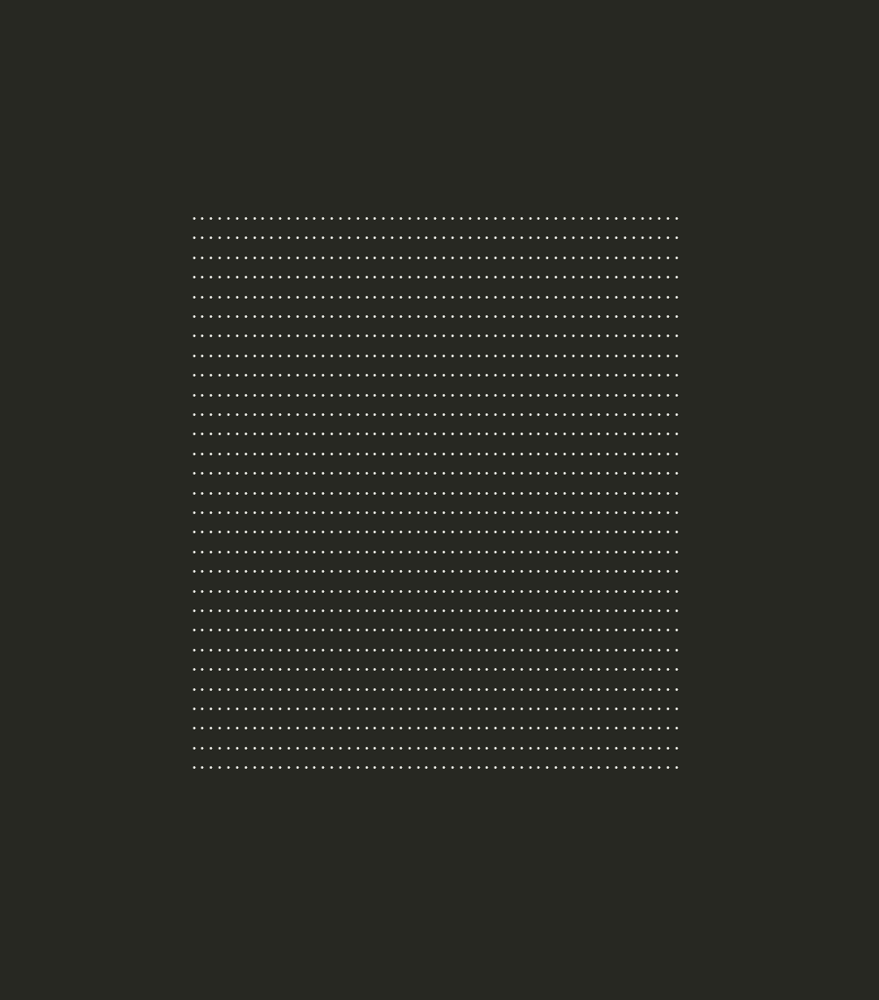

# cube

spinning cube (and the other platonic solids)

### usage
```sh
usage: cube [--shape]

shapes:
  --cube (default)
  --tetrahedron
  --octahedron
  --dodecahedron
  --icosahedron
```

q or esc quits.

### if you're on gentoo:
```sh
emerge --ask app-eselect/eselect-repository
eselect repository add noahburchell git https://github.com/noahburchell/noahburchell-overlay.git
emaint sync --repo noahburchell
emerge --ask app-misc/cube
cube --help
```
### if you're on nix:

run it without installing anything:
```sh
nix run github:noahburchell/cube
nix run github:noahburchell/cube -- --icosahedron
```

install it into your profile:
```sh
nix profile install github:noahburchell/cube
```

or add it to a flake:
```nix
{
  inputs.cube.url = "github:noahburchell/cube";

  # then, in your config:
  #   environment.systemPackages = [ inputs.cube.packages.${pkgs.system}.default ];
  # or, with the overlay:
  #   nixpkgs.overlays = [ inputs.cube.overlays.default ];
  #   environment.systemPackages = [ pkgs.cube ];
}
```

hacking on it (drops you in a shell with gcc, make, bear, clangd and gdb):
```sh
nix develop
make
```

distro support status:
  - gentoo ✅
  - nix ✅
  - arch ❔ (i made the PKGBUILD, but AUR account registrations are closed)
  - everything else ❌

### if you're on a different distro:
you have to build it

dependencies:
  - linux
  - make
  - gcc 14+ (or clang 19+)


#### get the source
grab the release tarball:

```
curl -LO https://github.com/noahburchell/cube/archive/refs/tags/v1.1.1.tar.gz
tar xf v1.1.1.tar.gz
cd cube-1.1.1
```

or clone the repo:

```
git clone --depth 1  https://github.com/noahburchell/cube.git
cd cube
```

#### build it

```
make -j$(nproc)
sudo make install
cube --help
```

`make install` puts the binary in `/usr/bin` by default. so if you don't have root, or you
just don't want it there:

```
make install PREFIX="$HOME/.local" # make sure its in path
```

### configuration

are you unhappy with the characters i chose for shading?
  - change them in shapes.c, it should be clear how to do so

do you want the shapes to spin faster/slower?
  - spin period was chosen for a reason. changing it may introduce stutter

### demo



### contact

if you have any questions contact me: cube@nburch.org

### license

GNU General Public Licence v3.0
